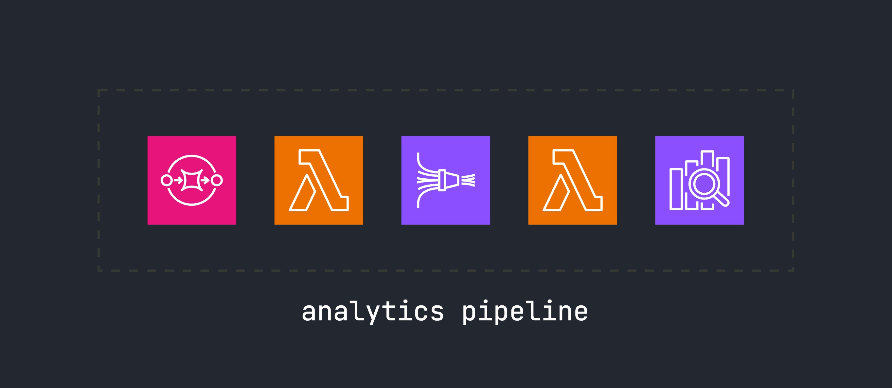

# terraform-aws-firehose-analytics

> Complete analytics pipeline from SQS to S3 and OpenSearch with optional data transformation

Terraform module that creates a complete analytics pipeline: SQS → Lambda Bridge → Kinesis Data Firehose → S3 + OpenSearch, with optional Lambda data transformation.



## Features

- **SQS to Firehose Bridge** - Reliable message processing with batching
- **Optional Data Transformation** - Lambda-based field mapping and filtering
- **Dual Destinations** - S3 storage + OpenSearch analytics in single stream
- **SNS Integration** - Built-in support for SNS message unwrapping
- **Multi-source Support** - SNS, EventBridge, Lambda integration
- **Minimal Configuration** - Sensible defaults, easy customization

## Quick Start

### 1. Deploy Infrastructure

```hcl
module "analytics" {
  source = "git::https://github.com/ql4b/terraform-aws-firehose-analytics.git"
  
  context    = module.label.context
  attributes = ["analytics"]
  
  # Data transformation (optional)
  enable_transform   = true
  transform_template = "sns-transform.js"  # For SNS messages
  
  transform = {
    fields = ["orderID", "price", "currency"]
    mappings = {
      "@timestamp" = "created_at"
      "booking.id" = "orderID"
    }
  }
  
  # Data sources
  data_sources = [{
    type = "sns"
    arn  = aws_sns_topic.events.arn
  }]
}
```

### 2. Deploy SQS Bridge Image

After applying the Terraform configuration, you need to push the SQS bridge image to the private ECR repository created by the module:

```bash
# Get the private ECR repository URL
PRIVATE_REPO=$(tf output -json analytics | jq -r .sqs_bridge_ecr.repository_url)

# Login to ECR
aws ecr get-login-password --region $(aws configure get region) | \
  docker login --username AWS --password-stdin $PRIVATE_REPO

# Copy public image to your private repository
docker pull public.ecr.aws/ql4b/sqs-firehose-bridge:latest
docker tag public.ecr.aws/ql4b/sqs-firehose-bridge:latest $PRIVATE_REPO:latest
docker push $PRIVATE_REPO:latest
```

### 3. Update Lambda Function

After pushing the image, update the Lambda function to use the new image:

```bash
# Get the Lambda function name
FUNCTION_NAME=$(terraform output -json analytics | jq -r .sqs_bridge_lambda.function_name)

# Update function code
aws lambda update-function-code \
  --function-name $FUNCTION_NAME \
  --image-uri $PRIVATE_REPO:latest
```

**Note**: The single Firehose stream automatically delivers data to both S3 and OpenSearch when `enable_opensearch = true`.

## Configuration

### Transform Templates

- **`transform.js`** - Basic field mapping and filtering
- **`sns-transform.js`** - SNS message unwrapping with MessageAttributes extraction

### Transform Configuration

```hcl
transform = {
  # Fields to include (empty = all fields)
  fields = ["field1", "field2"]
  
  # Field mappings (target = source)
  mappings = {
    "@timestamp"    = "created_at"
    "booking.id"    = "orderID"
    "user.email"    = "email"
  }
}
```

#### SNS Transform Field Behavior

The `sns-transform.js` template handles field inclusion based on your configuration:

- **Case 1:** `fields = []` and `mappings = {}` → Include all original data
- **Case 2:** `fields = ["field1"]` and `mappings = {}` → Include only specified fields  
- **Case 3:** `fields = []` and `mappings = {"new": "old"}` → Include only mapped fields (no duplicates)
- **Case 4:** `fields = ["field1"]` and `mappings = {"new": "old"}` → Include specified fields + mapped fields

**Example:**
```hcl
# Case 3: Only mapped fields
transform = {
  fields = []
  mappings = {
    "order_id" = "orderId"
    "user_email" = "email"
  }
}
```

**Input:** `{"orderId": "123", "email": "user@example.com", "amount": 99.99}`

**Output:** `{"messageId": "...", "timestamp": "...", "order_id": "123", "user_email": "user@example.com"}`

*Note: `amount` is excluded because it's not in fields or mappings.*

### Data Sources

```hcl
data_sources = [
  {
    type = "sns"
    arn  = aws_sns_topic.events.arn
  }
]
```

## Outputs

- `sqs_bridge_ecr.repository_url` - Private ECR repository for the bridge image
- `sqs_bridge_lambda.function_name` - Lambda function name
- `firehose_stream_name` - Main Kinesis Data Firehose stream name
- `s3_bucket_name` - S3 bucket for analytics data and failed records
- `opensearch_stream_name` - OpenSearch delivery stream name (when enabled)

## Architecture

```
Data Sources → SQS Queue → Lambda Bridge → Kinesis Data Firehose → S3 + OpenSearch
                                              ↓
                                        Transform Lambda (optional)
```

### Components

- **SQS Queue** - Reliable message buffering with DLQ
- **Lambda Bridge** - Polls SQS and forwards to Firehose
- **Transform Lambda** - Optional data transformation (Node.js 22)
- **Kinesis Data Firehose** - Managed delivery to dual destinations
- **S3 Bucket** - Compressed, partitioned storage + failed records backup
- **OpenSearch** - Real-time analytics and dashboards

## Examples

### Basic Analytics Pipeline

```hcl
module "analytics" {
  source = "git::https://github.com/ql4b/terraform-aws-firehose-analytics.git"
  
  context = module.label.context
  
  data_sources = [{
    type = "sns"
    arn  = aws_sns_topic.events.arn
  }]
}
```

### SNS Message Processing

```hcl
module "analytics" {
  source = "git::https://github.com/ql4b/terraform-aws-firehose-analytics.git"
  
  context = module.label.context
  
  enable_transform   = true
  transform_template = "sns-transform.js"
  
  transform = {
    fields = []  # Include all fields
    mappings = {
      "@timestamp" = "created_at"
    }
  }
  
  data_sources = [{
    type = "sns"
    arn  = aws_sns_topic.booking_events.arn
  }]
}
```

**Example SQS message:**
```json
{
  "timestamp": "2024-01-15T10:30:00Z",
  "method": "POST",
  "path": "/events",
  "sourceIp": "192.168.1.1",
  "requestId": "abc-123-def",
  "body": {
    "event": "order_placed",
    "orderId": "123"
  }
}
```

## Requirements

- Terraform >= 1.0
- AWS provider >= 5.0
- Docker (for image deployment)

## License

MIT